# ProxLB - Architecture & Algorithm Documentation

> **Purpose:** This document explains the entire ProxLB codebase so that customer questions
> about how it works can be answered quickly and precisely.

---

## Table of Contents

1. [What is ProxLB?](#1-what-is-proxlb)
2. [Project Structure](#2-project-structure)
3. [Overall Flow (Big Picture)](#3-overall-flow-big-picture)
4. [Data Collection - What is Fetched from the Cluster?](#4-data-collection---what-is-fetched-from-the-cluster)
5. [The Three Balancing Modes](#5-the-three-balancing-modes)
6. [The Three Balancing Methods](#6-the-three-balancing-methods)
7. [The Core Algorithm in Detail](#7-the-core-algorithm-in-detail)
8. [Decision Tree: "Will Balancing Occur?"](#8-decision-tree-will-balancing-occur)
9. [Affinity & Anti-Affinity](#9-affinity--anti-affinity)
10. [Node Pinning](#10-node-pinning)
11. [Maintenance Mode](#11-maintenance-mode)
12. [Ignore (Excluding Guests)](#12-ignore-excluding-guests)
13. [Node Resource Reservation](#13-node-resource-reservation)
14. [PSI Mode (Pressure Stall Information)](#14-psi-mode-pressure-stall-information)
15. [Migration: How Are VMs/CTs Actually Moved?](#15-migration-how-are-vmsCTs-actually-moved)
16. [Configuration Reference](#16-configuration-reference)
17. [Tagging Reference](#17-tagging-reference)
18. [Frequently Asked Questions (FAQ)](#18-frequently-asked-questions-faq)
19. [File Overview](#19-file-overview)

---

## 1. What is ProxLB?

ProxLB is a load balancer for **Proxmox VE clusters**. It automatically distributes running VMs and containers
(CTs) across the nodes of a cluster based on resource usage (CPU, RAM, disk).

**Core idea:** The node with the highest load offloads guests to the node with the lowest load,
until the difference falls below a configurable threshold ([`balanciness`](#cfg-balanciness)).

---

## 2. Project Structure

```
proxlb/
├── main.py                      # Entry point, main loop
├── models/
│   ├── calculations.py          # CORE ALGORITHM: Balancing logic
│   ├── balancing.py             # Migration execution via Proxmox API
│   ├── nodes.py                 # Collect node metrics
│   ├── guests.py                # Collect VM/CT metrics
│   ├── groups.py                # Form affinity/anti-affinity groups
│   ├── tags.py                  # Tag evaluation (plb_*)
│   ├── pools.py                 # Pool memberships
│   ├── ha_rules.py              # HA rule evaluation (PVE 9+)
│   └── features.py              # PVE version compatibility
└── utils/
    ├── proxmox_api.py           # API connection & authentication
    ├── config_parser.py         # Load YAML config
    ├── cli_parser.py            # CLI arguments (-d, -j, -b, etc.)
    ├── helper.py                # Helper functions (UUID, logging, etc.)
    └── logger.py                # Systemd-compatible logging
```

---

## 3. Overall Flow (Big Picture)

```mermaid
flowchart TD
    START([ProxLB Start]) --> INIT[Parse CLI arguments<br/>Load config<br/>Connect to API]
    INIT --> LOOP_START{Main Loop}

    LOOP_START --> RELOAD{SIGHUP<br/>received?}
    RELOAD -->|Yes| RELOAD_CFG[Reload config]
    RELOAD_CFG --> COLLECT
    RELOAD -->|No| COLLECT

    COLLECT[/"<b>Phase 1: Collect Data</b><br/>① Nodes + metrics<br/>② Pools<br/>③ HA rules<br/>④ Guests (VMs + CTs)<br/>⑤ Form groups"/]

    COLLECT --> FEATURES[Check PVE version<br/>Enable/disable features]
    FEATURES --> ASSIGN["<b>Phase 2: Initial Assignment</b><br/>Calculate node resources from groups"]
    ASSIGN --> HOT[PSI: Mark nodes/guests as HOT]
    HOT --> BEST[Determine best node<br/>= node with lowest load]

    BEST --> BEST_OK{Node<br/>found?}
    BEST_OK -->|No| SKIP[Skip run]
    BEST_OK -->|Yes| VALIDATE

    VALIDATE["<b>Phase 3: Check Constraints</b><br/>① Validate affinity map<br/>② Relocate maintenance guests"]

    VALIDATE --> BALANCINESS["<b>Phase 4: Calculate Balanciness</b><br/>max% - min% > threshold?"]

    BALANCINESS --> RELOCATE["<b>Phase 5: Redistribute Guests</b><br/>(Core Algorithm)"]

    RELOCATE --> EXECUTE{Balancing<br/>enabled &<br/>no dry-run?}
    EXECUTE -->|Yes| MIGRATE["<b>Phase 6: Execute Migrations</b><br/>API calls to Proxmox"]
    EXECUTE -->|No| OUTPUT

    MIGRATE --> OUTPUT[JSON output<br/>optional]
    SKIP --> OUTPUT
    OUTPUT --> DAEMON{Daemon<br/>mode?}
    DAEMON -->|Yes| SLEEP[Wait until next run]
    SLEEP --> LOOP_START
    DAEMON -->|No| END([End])
```



**Source code reference:** `main.py:32-120`

---

## 4. Data Collection - What is Fetched from the Cluster?

### 4.1 Node Metrics (`models/nodes.py`)

The following values are collected for each **online** node:

| Metric | Source | Description |
|--------|--------|-------------|
| `cpu_total` | `node["maxcpu"]` | Number of CPU cores |
| `cpu_used` | `node["cpu"] * node["maxcpu"]` | Currently used CPU (in cores) |
| `cpu_free` | `maxcpu - cpu_used` | Free CPU cores |
| `memory_total` | `node["maxmem"]` - reserve | Total RAM (minus optional [`node_resource_reserve`](#cfg-node_resource_reserve)) |
| `memory_used` | `node["mem"]` | Currently used RAM |
| `memory_free` | `maxmem - mem` | Free RAM |
| `disk_total` | `node["maxdisk"]` | Total disk space |
| `disk_used` | `node["disk"]` | Used disk space |
| `disk_free` | `maxdisk - disk` | Free disk space |
| `*_assigned` | Initially 0 | Sum of **assigned** resources of all guests |
| `*_pressure_*` | RRD data | PSI metrics (PVE 9+ only, see [`psi`](#cfg-psi)) |
| `pve_version` | `/version` API | Proxmox VE version of the node |
| `maintenance` | Config / HA API | Maintenance status (see [`maintenance_nodes`](#cfg-maintenance_nodes)) |

**Important:** `*_used` = what the node **actually consumes**.
`*_assigned` = what the guests have **configured** (can be higher due to overprovisioning).

### 4.2 Guest Metrics (`models/guests.py`)

For each **running** guest (VM & CT):

| Metric | Description |
|--------|-------------|
| `cpu_total` | Assigned vCPUs |
| `cpu_used` | Average CPU usage (from RRD data) |
| `memory_total` | Assigned RAM |
| `memory_used` | Currently used RAM |
| `disk_total` | Assigned disk |
| `disk_used` | Used disk |
| `tags` | Proxmox tags (for `plb_*` control) |
| `pools` | Pool memberships |
| `ha_rules` | HA rules affecting this guest |
| `affinity_groups` | Affinity groups |
| `anti_affinity_groups` | Anti-affinity groups |
| `node_relationships` | Pinning targets |
| `ignore` | Should the guest be ignored? |
| `node_current` | Current node |
| `node_target` | Target node (initially = `node_current`) |

### 4.3 Groups (`models/groups.py`)

Each guest is assigned to a group:


**Each guest is ALWAYS in exactly one affinity group** (either explicitly or in its
own UUID group). This simplifies the algorithm since it always iterates over groups.

---

## 5. The Three Balancing Modes


| Mode | When to use? | Comparison value | Config |
|------|-------------|------------------|--------|
| `used` (default) | Clusters with dynamic workloads where actual load matters | `{method}_used_percent` | [`mode: used`](#cfg-mode) |
| `assigned` | Stable environments where overprovisioning should be avoided | `{method}_assigned_percent` | [`mode: assigned`](#cfg-mode) |
| `psi` | PVE 9+ clusters where pressure metrics provide more accurate insights | `{method}_pressure_full_spikes_percent` | [`mode: psi`](#cfg-mode) |

---

## 6. The Three Balancing Methods


The **method** determines **which resource** is used for the balancing decision.
The **mode** determines **how** that resource is measured.

**Example:** [`method: memory`](#cfg-method) + [`mode: used`](#cfg-mode) = balancing based on actually used RAM.

---

## 7. The Core Algorithm in Detail

### 7.1 Overview Diagram

```mermaid
flowchart TD
    START([relocate_guests]) --> CHECK_TRIGGER{"Trigger present?<br/>① balanciness exceeded<br/>② enforce_affinity<br/>③ enforce_pinning"}

    CHECK_TRIGGER -->|No| DONE([No balancing needed])
    CHECK_TRIGGER -->|Yes| SORT["Sort affinity groups:<br/>1. By member count ↑<br/>2. By RAM usage ↑/↓"]

    SORT --> FOR_GROUP["For each affinity group:"]
    FOR_GROUP --> RECHECK{"Balanciness<br/>still needed?"}
    RECHECK -->|No| DONE
    RECHECK -->|Yes| FOR_GUEST["For each guest in group:"]

    FOR_GUEST --> CHECK_SOURCE{"Is current node<br/>still the most<br/>loaded?"}
    CHECK_SOURCE -->|No| NEXT_GROUP[Next group]
    CHECK_SOURCE -->|Yes| CHECK_RES{"Target node has<br/>enough resources?"}

    CHECK_RES -->|No| SKIP_GUEST[Skip guest]
    CHECK_RES -->|Yes| PSI_CHECK{PSI mode?}

    PSI_CHECK -->|Yes| PSI_SELECT["Select guest with highest<br/>pressure spike"]
    PSI_CHECK -->|No| NORMAL_SELECT["Set current guest<br/>as candidate"]

    PSI_SELECT --> ANTI_AFF
    NORMAL_SELECT --> ANTI_AFF

    ANTI_AFF["Check anti-affinity<br/>→ adjust target node if needed"]
    ANTI_AFF --> PIN["Check node pinning<br/>→ adjust target node if needed"]
    PIN --> UPDATE["Update node resources:<br/>+ to target node<br/>- from source node"]

    UPDATE --> NEXT_GUEST[Next guest]
    SKIP_GUEST --> NEXT_GUEST
    NEXT_GUEST --> FOR_GUEST
    NEXT_GROUP --> FOR_GROUP
```



**Source code:** `models/calculations.py:394-498`

### 7.2 Step by Step

#### Step 1: Check trigger (`calculations.py:414`)
```python
if balance OR enforce_affinity OR enforce_pinning:
    # → Proceed with balancing
```

There are **three reasons** for balancing:
1. **[`balanciness`](#cfg-balanciness) threshold exceeded** (load difference too large)
2. **Affinity/anti-affinity violated** (guests are on the wrong nodes, see [Affinity](#9-affinity--anti-affinity))
3. **Pinning violated** (guests are not on their pinned node, see [Pinning](#10-node-pinning))

#### Step 2: Sort groups (`calculations.py:436-444`)
Affinity groups are sorted by:
1. **Member count** (ascending) — single guests first to avoid unnecessary relocations
2. **RAM usage** (ascending/descending, depending on [`balance_larger_guests_first`](#cfg-balance_larger_guests_first))

#### Step 3: Re-check balanciness per group (`calculations.py:450-455`)
Before each group, the balanciness is **recalculated**. If the load is already
balanced AND no affinity/pinning rules are violated → abort.

#### Step 4: For each guest in the group (`calculations.py:457-497`)

```
1. Check: Is the source node still the most loaded?
   → No? → Next group (break)

2. Check: Does the target node have enough free resources?
   → No? → Skip guest (continue)

3. PSI mode? → Select guest with highest pressure spike

4. Validate anti-affinity → assign different target node if needed

5. Validate node pinning → assign different target node if needed

6. Update node resources (calculated):
   - Target node: add resources
   - Source node: subtract resources
   - guest.node_target = new target node
```

### 7.3 Resource Update in Detail (`calculations.py:601-680`)


**Important:** The resources are only **recalculated on paper**.
The actual migration happens only in Phase 6 (`Balancing` class).

---

## 8. Decision Tree: "Will Balancing Occur?"

```mermaid
flowchart TD
    START([get_balanciness]) --> MODE{Mode?}

    MODE -->|used / assigned| CALC["Calculate for all nodes:<br/>max_percent = highest utilization<br/>min_percent = lowest utilization"]
    MODE -->|psi| PSI_CHECK

    CALC --> THRESHOLD{Threshold<br/>configured?}
    THRESHOLD -->|Yes| THRESH_CHECK{"highest_node ≥<br/>threshold?"}
    THRESH_CHECK -->|Yes| BALANCE_YES["balance = true"]
    THRESH_CHECK -->|No| BALANCE_NO["balance = false"]

    THRESHOLD -->|No| DELTA_CHECK

    BALANCE_YES --> DELTA_CHECK
    BALANCE_NO --> DELTA_CHECK

    DELTA_CHECK{"max% - min% ><br/>balanciness?"}
    DELTA_CHECK -->|Yes| FINAL_YES(["✓ Balancing will be executed"])
    DELTA_CHECK -->|No| FINAL_MAYBE{"enforce_affinity<br/>or enforce_pinning?"}
    FINAL_MAYBE -->|Yes| FINAL_YES
    FINAL_MAYBE -->|No| FINAL_NO(["✗ No balancing needed"])

    PSI_CHECK{"Any node<br/>or guest HOT?"}
    PSI_CHECK -->|Yes| FINAL_YES
    PSI_CHECK -->|No| FINAL_NO
```



### Balanciness Formula (used/assigned)

```
Balanciness delta = max(node_percent) - min(node_percent)

If balanciness delta > balanciness (default: 10):
    → Balance = true
```

> Configured via [`balanciness`](#cfg-balanciness)

**Example:** Node A has 80% RAM, Node B has 30% RAM → delta = 50 > 10 → Balancing.

### Threshold Check (optional)

In addition to the balanciness, an **absolute threshold** ([`memory_threshold`](#cfg-memory_threshold) / [`cpu_threshold`](#cfg-cpu_threshold) / [`disk_threshold`](#cfg-disk_threshold)) can be defined:

```yaml
balancing:
  memory_threshold: 80  # Only balance when a node exceeds 80%
```

→ Even if the delta > [`balanciness`](#cfg-balanciness), balancing only occurs if the highest node
is **above** the threshold.

---

## 9. Affinity & Anti-Affinity

### 9.1 Sources for Affinity/Anti-Affinity

```mermaid
flowchart TD
    SOURCES["Three sources for<br/>affinity rules"] --> TAGS["<b>① Proxmox Tags</b><br/>plb_affinity_GROUPNAME<br/>plb_anti_affinity_GROUPNAME"]
    SOURCES --> POOLS["<b>② Pools + Config</b><br/>Pool in proxlb.yaml with<br/>type: affinity / anti-affinity"]
    SOURCES --> HA["<b>③ HA Rules</b> (PVE 9+)<br/>Proxmox HA Affinity Rules"]
```



### 9.2 Affinity = "Together on One Node"

**Validation** (`calculations.py:741-780`):

```mermaid
flowchart TD
    CHECK["For each affinity group:"] --> NODES["Collect nodes of all<br/>group members"]
    NODES --> SAME{"All on the<br/>same node?"}
    SAME -->|Yes| MAINT{"Node in<br/>maintenance?"}
    MAINT -->|No| OK(["✓ OK"])
    MAINT -->|Yes| VIOLATE
    SAME -->|No| VIOLATE(["✗ Violated!<br/>→ enforce_affinity = true"])
```



**How is affinity enforced?**
Since all guests in an affinity group are in the same affinity group in the algorithm,
they are **moved together** to the best node (the algorithm iterates
over guests within the group).

### 9.3 Anti-Affinity = "Separated on Different Nodes"

**Validation** (`calculations.py:783-819`):

```mermaid
flowchart TD
    CHECK["For each anti-affinity group:"] --> NODES["Collect nodes of all<br/>group members"]
    NODES --> UNIQUE{"All nodes<br/>different?"}
    UNIQUE -->|Yes| OK(["✓ OK"])
    UNIQUE -->|No| VIOLATE(["✗ Violated!<br/>→ enforce_affinity = true"])
```



**How is anti-affinity enforced?** (`calculations.py:501-552`)


Each anti-affinity group has a `used_nodes` list. For each guest, a
**not yet occupied** node from the cluster is selected.

---

## 10. Node Pinning

Pinning allows binding guests to specific nodes (e.g. for licensing reasons).

### 10.1 Sources for Pinning

| Source | Syntax | Example | Config |
|--------|--------|---------|--------|
| **Tag** | `plb_pin_NODENAME` | `plb_pin_pve01` | [Tagging Reference](#17-tagging-reference) |
| **Pool config** | [`pin: [node1, node2]`](#cfg-pools-pin) | In `proxlb.yaml` | [`pools.<pool>.pin`](#cfg-pools-pin) |
| **HA rule** | Node list in HA rule | PVE 9+ | - |

### 10.2 Strict vs. Non-Strict


- **Strict** (default for pools, [`strict: true`](#cfg-pools-strict)): Guest is **only** placed on pinned nodes
- **Non-strict** ([`strict: false`](#cfg-pools-strict)): Pinned nodes are **preferred**, but the best free node is also considered as a candidate

**Source code:** `calculations.py:554-598`

---

## 11. Maintenance Mode

### 11.1 Detection

Maintenance is detected from **two sources**:

```mermaid
flowchart TD
    DETECT["Maintenance<br/>Detection"] --> CONFIG["<b>① ProxLB Config</b><br/>proxmox_cluster:<br/>  maintenance_nodes:<br/>    - pve03"]
    DETECT --> HA_API["<b>② Proxmox HA API</b><br/>cluster.ha.status.current<br/>'maintenance mode' in status"]
```



### 11.2 What Happens During Maintenance?


**Source code:** `calculations.py:362-391`

---

## 12. Ignore (Excluding Guests)

### 12.1 Ignoring a Guest

A guest with the tag `plb_ignore_*` is **never relocated**, even if affinity rules are violated.


### 12.2 Ignoring a Node

An ignored node (via [`ignore_nodes`](#cfg-ignore_nodes) in config) is **completely skipped** —
including all guests on that node. These guests do not appear in the balancing.

**Source code:** `nodes.py:153-177`, `tags.py:183-210`

---

## 13. Node Resource Reservation

Reserves resources on a node that are **not** used for VM/CT placement
(e.g. for Proxmox's own services).

```yaml
balancing:
  node_resource_reserve:
    defaults:          # Applies to all nodes
      memory: 4        # Reserve 4 GB
    pve01:             # Node-specific
      memory: 8        # Reserve 8 GB on pve01
```

**Effect:** The `memory_total` value of the node is **reduced** by the reservation.
This makes the node appear "fuller" and fewer guests are assigned to it.

```
memory_total_effective = memory_total_real - reservation_gb * 1024³
```

**Source code:** `nodes.py:258-312`

---

## 14. PSI Mode (Pressure Stall Information)

### 14.1 What is PSI?

PSI measures the **pressure** on system resources (CPU, memory, I/O) — i.e. how long
processes had to wait. This is more meaningful than pure utilization numbers.

**Prerequisite:** Proxmox VE 9.0 or higher on **all** nodes. Activation via [`mode: psi`](#cfg-mode).

### 14.2 HOT Detection

```mermaid
flowchart TD
    NODE["Node/Guest<br/>PSI metrics"] --> CHECK{"(pressure_full ≥ threshold_full<br/>AND pressure_some ≥ threshold_some)<br/>OR<br/>pressure_spikes ≥ threshold_spikes"}

    CHECK -->|Yes| HOT["🔥 HOT!<br/>Balancing is triggered"]
    CHECK -->|No| COOL["Normal"]
```



### 14.3 PSI Configuration

```yaml
balancing:
  mode: psi
  psi:
    nodes:
      cpu:
        pressure_full: 5.0
        pressure_some: 10.0
        pressure_spikes: 20.0
      memory:
        pressure_full: 5.0
        pressure_some: 10.0
        pressure_spikes: 20.0
    guests:
      cpu:
        pressure_full: 10.0
        pressure_some: 20.0
        pressure_spikes: 30.0
```

### 14.4 PSI Data Sources

- **Average:** Mean of all RRD entries from the last hour (`cf=AVERAGE`)
- **Spikes:** Maximum of the last 6 RRD entries (`cf=MAX`, last ~6 minutes)

**Source code:** `calculations.py:96-171`, `nodes.py:178-222`

---

## 15. Migration: How Are VMs/CTs Actually Moved?

### 15.1 Migration Flow

```mermaid
sequenceDiagram
    participant PLB as ProxLB
    participant API as Proxmox API
    participant SRC as Source Node
    participant TGT as Target Node

    PLB->>PLB: For each guest check:<br/>node_current ≠ node_target?

    alt VM Migration
        PLB->>API: nodes(source).qemu(vmid).migrate.post(<br/>target, online, with-local-disks,<br/>with-conntrack-state)
        API->>SRC: Start migration
        SRC->>TGT: Live migration
    else CT Migration
        PLB->>API: nodes(source).lxc(ctid).migrate.post(<br/>target, restart=1)
        API->>SRC: Stop & migrate container
        SRC->>TGT: Restart on target
    end

    loop Check job status (every 10s)
        PLB->>API: nodes(source).tasks(job_id).status.get()
        API-->>PLB: running / stopped
    end

    alt HA Migration
        PLB->>API: HA job detected → search for qmigrate task
        PLB->>PLB: Override job ID, continue polling
    end
```



### 15.2 VM vs. CT Migration

| Property | VM (QEMU) | CT (LXC) |
|----------|-----------|----------|
| Method | `qemu.migrate.post()` | `lxc.migrate.post()` |
| Live migration | Yes (`online=1`) | No (restart) |
| Local disks | `with-local-disks=1` | Not applicable |
| Conntrack | `with-conntrack-state=1` | Not applicable |
| Downtime | Minimal (ms) | Container restart |

### 15.3 Parallel vs. Sequential Migration


### 15.4 Job Timeout

Maximum wait time: [`max_job_validation`](#cfg-max_job_validation) (default: 1800 seconds = 30 minutes)

**Source code:** `models/balancing.py:47-270`

---

## 16. Configuration Reference

### 16.1 API Connection (`proxmox_api`)

| Parameter | Type | Default | Description | Relevant in |
|-----------|------|---------|-------------|-------------|
| <a id="cfg-host"></a>`proxmox_api.host` | string | - | Proxmox host(s), comma-separated for redundancy | [Overall Flow](#3-overall-flow-big-picture) |
| <a id="cfg-user"></a>`proxmox_api.user` | string | - | Username (e.g. `proxlb@pam`) | [Overall Flow](#3-overall-flow-big-picture) |
| <a id="cfg-pass"></a>`proxmox_api.pass` | string | - | Password (alternative to token) | [Overall Flow](#3-overall-flow-big-picture) |
| <a id="cfg-token_name"></a>`proxmox_api.token_name` | string | - | API token name (alternative to password) | [Overall Flow](#3-overall-flow-big-picture) |
| <a id="cfg-token_value"></a>`proxmox_api.token_value` | string | - | API token value | [Overall Flow](#3-overall-flow-big-picture) |
| <a id="cfg-verify_ssl"></a>`proxmox_api.verify_ssl` | bool | `true` | Enable SSL verification | [Overall Flow](#3-overall-flow-big-picture) |
| <a id="cfg-port"></a>`proxmox_api.port` | int | `8006` | API port | [Overall Flow](#3-overall-flow-big-picture) |

### 16.2 Cluster Settings (`proxmox_cluster`)

| Parameter | Type | Default | Description | Relevant in |
|-----------|------|---------|-------------|-------------|
| <a id="cfg-maintenance_nodes"></a>`proxmox_cluster.maintenance_nodes` | list | `[]` | Nodes in maintenance mode — all guests are migrated away | [Maintenance Mode](#11-maintenance-mode) |
| <a id="cfg-ignore_nodes"></a>`proxmox_cluster.ignore_nodes` | list | `[]` | Completely ignore nodes — including all guests on them | [Ignore](#12-ignore-excluding-guests) |

### 16.3 Balancing Base Settings (`balancing`)

| Parameter | Type | Default | Description | Relevant in |
|-----------|------|---------|-------------|-------------|
| <a id="cfg-method"></a>`balancing.method` | string | `memory` | Balancing method: `memory`, `cpu` or `disk` | [Balancing Methods](#6-the-three-balancing-methods), [Core Algorithm](#7-the-core-algorithm-in-detail) |
| <a id="cfg-mode"></a>`balancing.mode` | string | `used` | Balancing mode: `used`, `assigned` or `psi` | [Balancing Modes](#5-the-three-balancing-modes), [Core Algorithm](#7-the-core-algorithm-in-detail), [PSI Mode](#14-psi-mode-pressure-stall-information) |
| <a id="cfg-balanciness"></a>`balancing.balanciness` | int | `10` | Max. allowed delta (%) between most and least loaded node | [Decision Tree](#8-decision-tree-will-balancing-occur), [Core Algorithm](#7-the-core-algorithm-in-detail) |
| <a id="cfg-memory_threshold"></a>`balancing.memory_threshold` | int | - | Absolute threshold (%): only balance when a node exceeds this | [Decision Tree](#8-decision-tree-will-balancing-occur) |
| <a id="cfg-cpu_threshold"></a>`balancing.cpu_threshold` | int | - | Like `memory_threshold`, but for CPU | [Decision Tree](#8-decision-tree-will-balancing-occur) |
| <a id="cfg-disk_threshold"></a>`balancing.disk_threshold` | int | - | Like `memory_threshold`, but for disk | [Decision Tree](#8-decision-tree-will-balancing-occur) |
| <a id="cfg-enable"></a>`balancing.enable` | bool | `false` | Enable balancing (actually execute migrations) | [Overall Flow](#3-overall-flow-big-picture), [Migration](#15-migration-how-are-vmsCTs-actually-moved) |
| <a id="cfg-balance_types"></a>`balancing.balance_types` | list | `[vm, ct]` | Which guest types are allowed to be migrated | [Migration](#15-migration-how-are-vmsCTs-actually-moved), [FAQ](#why-is-my-vm-not-being-moved) |

### 16.4 Migration Settings (`balancing`)

| Parameter | Type | Default | Description | Relevant in |
|-----------|------|---------|-------------|-------------|
| <a id="cfg-live"></a>`balancing.live` | bool | `true` | Live migration for VMs (online=1) vs. offline migration (online=0) | [Migration](#152-vm-vs-ct-migration) |
| <a id="cfg-with_local_disks"></a>`balancing.with_local_disks` | bool | `true` | Migrate local disks during VM migration | [Migration](#152-vm-vs-ct-migration) |
| <a id="cfg-with_conntrack_state"></a>`balancing.with_conntrack_state` | bool | `true` | Preserve conntrack state during VM migration (not for older PVE) | [Migration](#152-vm-vs-ct-migration) |
| <a id="cfg-parallel"></a>`balancing.parallel` | bool | `false` | Enable parallel migration | [Migration](#153-parallel-vs-sequential-migration) |
| <a id="cfg-parallel_jobs"></a>`balancing.parallel_jobs` | int | `5` | Max. simultaneous migrations (only with parallel=true) | [Migration](#153-parallel-vs-sequential-migration) |
| <a id="cfg-balance_larger_guests_first"></a>`balancing.balance_larger_guests_first` | bool | `false` | Move larger guests (by RAM) first | [Core Algorithm Step 2](#step-2-sort-groups-calculationspy436-444) |
| <a id="cfg-max_job_validation"></a>`balancing.max_job_validation` | int | `1800` | Max. wait time (sec.) for a single migration | [Migration](#154-job-timeout) |

### 16.5 Node Resource Reservation (`balancing.node_resource_reserve`)

| Parameter | Type | Default | Description | Relevant in |
|-----------|------|---------|-------------|-------------|
| <a id="cfg-node_resource_reserve"></a>`balancing.node_resource_reserve.defaults.memory` | int (GB) | `0` | Default RAM reservation for all nodes | [Node Resource Reservation](#13-node-resource-reservation) |
| `balancing.node_resource_reserve.<node>.memory` | int (GB) | `0` | Node-specific RAM reservation (overrides default) | [Node Resource Reservation](#13-node-resource-reservation) |

### 16.6 Pool Configuration (`balancing.pools`)

| Parameter | Type | Default | Description | Relevant in |
|-----------|------|---------|-------------|-------------|
| <a id="cfg-pools"></a><a id="cfg-pools-type"></a>`balancing.pools.<pool>.type` | string | - | Pool type: `affinity` or `anti-affinity` | [Affinity](#9-affinity--anti-affinity) |
| <a id="cfg-pools-pin"></a>`balancing.pools.<pool>.pin` | list | `[]` | Nodes for pinning this pool | [Node Pinning](#10-node-pinning) |
| <a id="cfg-pools-strict"></a>`balancing.pools.<pool>.strict` | bool | `true` | Strict pinning: only allow pinned nodes as target | [Node Pinning](#102-strict-vs-non-strict) |

### 16.7 PSI Thresholds (`balancing.psi`)

| Parameter | Type | Default | Description | Relevant in |
|-----------|------|---------|-------------|-------------|
| <a id="cfg-psi"></a><a id="cfg-psi-nodes"></a>`balancing.psi.nodes.<metric>.pressure_full` | float | - | Threshold for "full" pressure on nodes | [PSI HOT Detection](#142-hot-detection) |
| `balancing.psi.nodes.<metric>.pressure_some` | float | - | Threshold for "some" pressure on nodes | [PSI HOT Detection](#142-hot-detection) |
| `balancing.psi.nodes.<metric>.pressure_spikes` | float | - | Threshold for pressure spikes on nodes | [PSI HOT Detection](#142-hot-detection) |
| <a id="cfg-psi-guests"></a>`balancing.psi.guests.<metric>.pressure_full` | float | - | Threshold for "full" pressure on guests | [PSI HOT Detection](#142-hot-detection) |
| `balancing.psi.guests.<metric>.pressure_some` | float | - | Threshold for "some" pressure on guests | [PSI HOT Detection](#142-hot-detection) |
| `balancing.psi.guests.<metric>.pressure_spikes` | float | - | Threshold for pressure spikes on guests | [PSI HOT Detection](#142-hot-detection) |

> `<metric>` = `cpu`, `memory` or `disk` (depending on [`method`](#cfg-method))

### 16.8 Service Settings (`service`)

| Parameter | Type | Default | Description | Relevant in |
|-----------|------|---------|-------------|-------------|
| <a id="cfg-log_level"></a>`service.log_level` | string | `INFO` | Log level: `DEBUG`, `INFO`, `WARNING`, `ERROR`, `CRITICAL` | [Overall Flow](#3-overall-flow-big-picture) |
| <a id="cfg-daemon"></a>`service.daemon` | bool | `false` | Enable daemon mode (infinite loop) | [FAQ](#how-does-daemon-mode-work) |
| <a id="cfg-schedule"></a>`service.schedule` | string | - | Cron schedule for daemon mode (e.g. `0 */6 * * *`) | [FAQ](#how-does-daemon-mode-work) |

### 16.9 Complete Example Configuration

```yaml
# === API Connection ===
proxmox_api:
  host: "pve01.example.com"       # → Details: see proxmox_api.host above
  user: "proxlb@pam"
  pass: "secret"
  verify_ssl: true
  port: 8006

# === Cluster Settings ===
proxmox_cluster:
  maintenance_nodes:               # → Details: Section 11 (Maintenance Mode)
    - pve03
  ignore_nodes:                    # → Details: Section 12 (Ignore)
    - pve-backup

# === Balancing Settings ===
balancing:
  method: memory                   # → Details: Section 6 (Balancing Methods)
  mode: used                       # → Details: Section 5 (Balancing Modes)
  balanciness: 10                  # → Details: Section 8 (Decision Tree)
  memory_threshold: 80             # → Details: Section 8 (Threshold Check)
  enable: true                     # → Details: Section 15 (Migration)
  balance_types: [vm, ct]          # → Details: Section 15.2 (VM vs. CT)
  live: true                       # → Details: Section 15.2 (VM vs. CT)
  with_local_disks: true           # → Details: Section 15.2 (VM vs. CT)
  with_conntrack_state: true       # → Details: Section 15.2 (VM vs. CT)
  parallel: false                  # → Details: Section 15.3 (Parallel)
  parallel_jobs: 5                 # → Details: Section 15.3 (Parallel)
  balance_larger_guests_first: false  # → Details: Section 7.2 Step 2
  max_job_validation: 1800         # → Details: Section 15.4 (Job Timeout)

  node_resource_reserve:           # → Details: Section 13 (Reservation)
    defaults:
      memory: 4
    pve01:
      memory: 8

  pools:                           # → Details: Section 9 (Affinity) & 10 (Pinning)
    db_pool:
      type: affinity
      pin: [pve01, pve02]
      strict: true

  psi:                             # → Details: Section 14 (PSI Mode)
    nodes:
      cpu:
        pressure_full: 5.0
        pressure_some: 10.0
        pressure_spikes: 20.0
      memory:
        pressure_full: 5.0
        pressure_some: 10.0
        pressure_spikes: 20.0
    guests:
      cpu:
        pressure_full: 10.0
        pressure_some: 20.0
        pressure_spikes: 30.0

# === Service Settings ===
service:
  log_level: INFO
  daemon: true
  schedule: "0 */6 * * *"
```

---

## 17. Tagging Reference

Tags are set directly in Proxmox on VMs/CTs:

| Tag | Effect | Example |
|-----|--------|---------|
| `plb_affinity_GROUPNAME` | All guests with the same group name are placed **together** on one node | `plb_affinity_db_cluster` |
| `plb_anti_affinity_GROUPNAME` | All guests with the same group name are distributed across **different** nodes | `plb_anti_affinity_web_ha` |
| `plb_ignore_*` | Guest is **never** relocated | `plb_ignore_licensing` |
| `plb_pin_NODENAME` | Guest is **pinned** to the named node | `plb_pin_pve01` |

**Multiple tags possible:** A guest can have e.g. both `plb_affinity_db` and `plb_pin_pve01` at the same time.

---

## 18. Frequently Asked Questions (FAQ)

### "Why is my VM not being moved?"

**Checklist:**
1. Does the VM have the tag `plb_ignore_*`? → It is ignored
2. Is the VM stopped? → Only running VMs are considered
3. Is the balanciness delta below the threshold? → No balancing needed (see [`balanciness`](#cfg-balanciness))
4. Is [`balance_types`](#cfg-balance_types) configured correctly? → `vm` and/or `ct` must be included
5. Does the target node have enough resources? → Memory-free check
6. Is dry-run active (`-d`)? → Migrations are only simulated
7. Is the node on [`ignore_nodes`](#cfg-ignore_nodes)? → Node and all guests are ignored

### "Why are guests being moved even though the load seems balanced?"

**Possible reasons:**
1. **Affinity/anti-affinity violated:** `enforce_affinity = true` triggers balancing even when the threshold is not exceeded
2. **Pinning violated:** Guest is not on the pinned node
3. **Maintenance:** Guests on maintenance nodes are always relocated
4. **Different mode:** [`used` vs. `assigned`](#cfg-mode) can differ significantly

### "What happens if an error occurs during migration?"

- ProxLB logs the error (`CRITICAL`)
- The migration is **not** retried
- Other migrations continue
- With parallel migration: the chunk is completed, then continues

### "Can ProxLB move a VM to an already full node?"

No. Before each migration, a check is performed (`validate_node_resources`):
```
guest.memory_used < target_node.memory_free
```
If there is not enough free memory, the guest is skipped.

### "How does daemon mode work?"

ProxLB runs in an infinite loop ([`daemon: true`](#cfg-daemon)) and executes balancing according to a cron schedule ([`schedule`](#cfg-schedule)). A SIGHUP signal reloads the configuration, SIGINT terminates the process.

### "What is the difference between 'used' and 'assigned'?"

| | `used` | `assigned` |
|--|--------|-----------|
| **Measures** | Actual consumption | Configured allocation |
| **Example** | VM uses 2 GB of 8 GB RAM | VM has 8 GB RAM assigned |
| **Advantage** | Reacts to real load | Prevents overprovisioning |
| **Disadvantage** | Cannot prevent overprovisioning | Does not react to real load |

### "How many API calls does ProxLB make per run?"

The following API calls are made per run:
- 1x `nodes.get()`
- Per node: 1x `version.get()` + 8x `rrddata.get()` (4 metrics x 2 variants)
- 1x `pools.get()` + 1x per pool `pools(id).get()`
- 1x `cluster.ha.rules.get()` (PVE 9+)
- 1x `cluster.ha.status.current.get()` per node (maintenance check)
- Per node: 1x `qemu.get()` + 1x `lxc.get()`
- Per running guest: 1x `config.get()` + 8x `rrddata.get()`
- Per migration: 1x `migrate.post()` + Nx `tasks(id).status.get()` (polling)

---

## 19. File Overview

| File | Lines | Responsibility | Key Functions |
|------|-------|---------------|---------------|
| `main.py` | 121 | Entry point, main loop | `main()` |
| `models/calculations.py` | 890 | **Core algorithm** | `get_balanciness()`, `relocate_guests()`, `val_anti_affinity()`, `val_node_relationships()`, `update_node_resources()`, `validate_affinity_map()` |
| `models/balancing.py` | 271 | Migration execution | `exec_rebalancing_vm()`, `exec_rebalancing_ct()`, `get_rebalancing_job_status()` |
| `models/nodes.py` | 313 | Node data collection | `get_nodes()`, `set_node_maintenance()`, `set_node_ignore()`, `set_node_resource_reservation()` |
| `models/guests.py` | 216 | Guest data collection | `get_guests()`, `get_guest_rrd_data()` |
| `models/groups.py` | 125 | Group formation | `get_groups()` |
| `models/tags.py` | 284 | Tag evaluation | `get_tags_from_guests()`, `get_affinity_groups()`, `get_anti_affinity_groups()`, `get_ignore()`, `get_node_relationships()` |
| `models/pools.py` | 149 | Pool management | `get_pools()`, `get_pools_for_guest()`, `get_pool_node_affinity_strictness()` |
| `models/ha_rules.py` | 127 | HA rules | `get_ha_rules()`, `get_ha_rules_for_guest()` |
| `utils/proxmox_api.py` | ~150 | API connection | `api_connect()`, `test_api_proxmox_host()` |
| `utils/config_parser.py` | 97 | YAML parsing | `get_config()` |

---

## Appendix: Decision Matrix "Who Gets Moved Where?"


